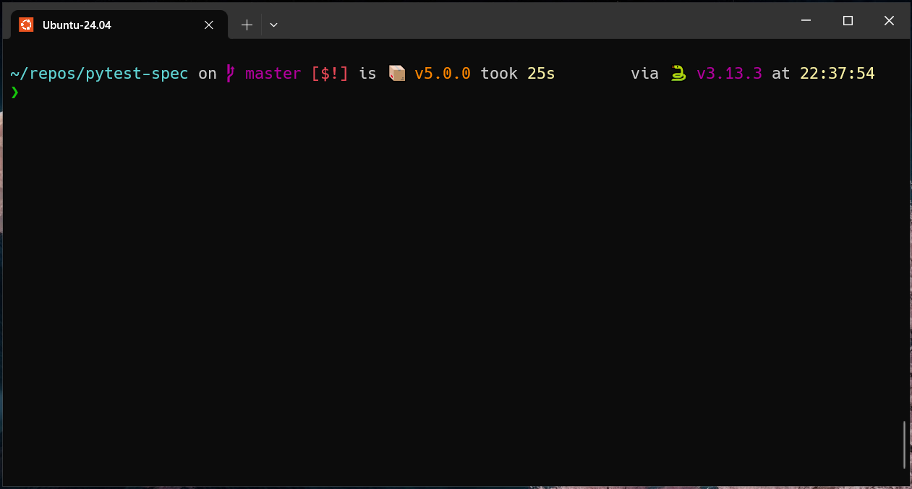
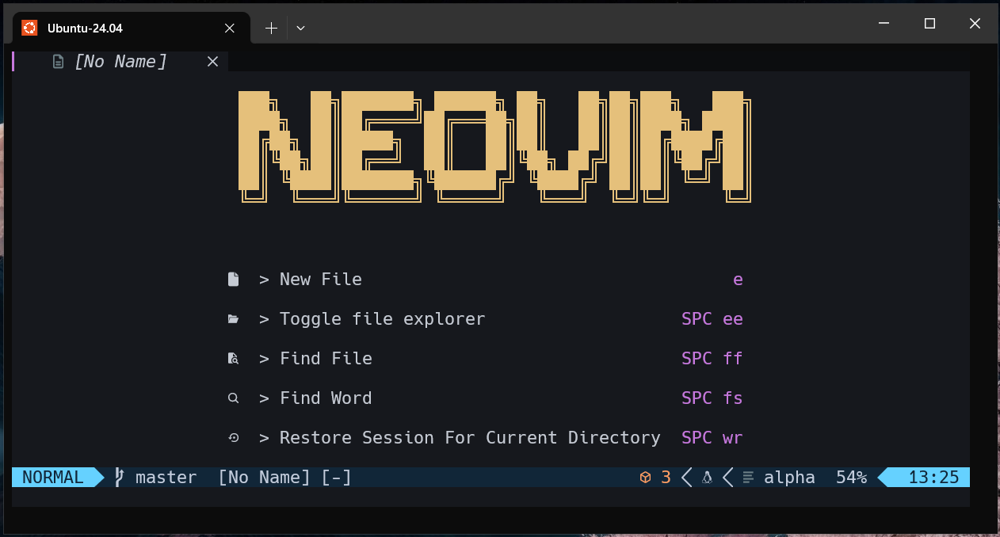
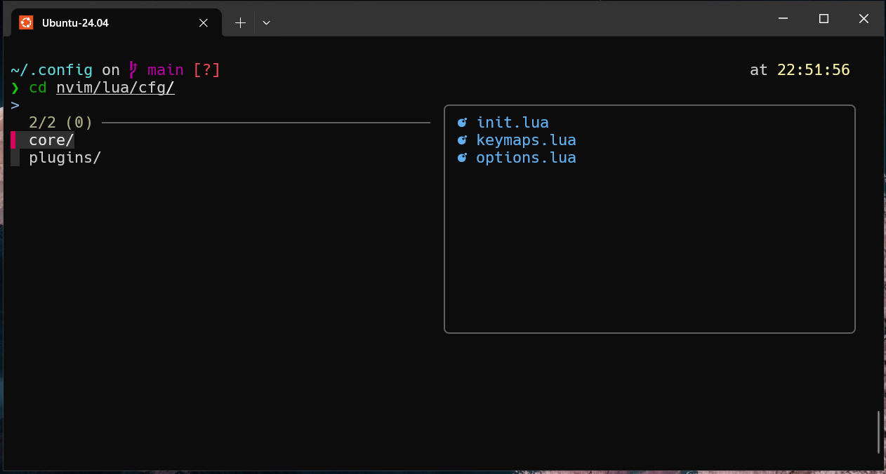
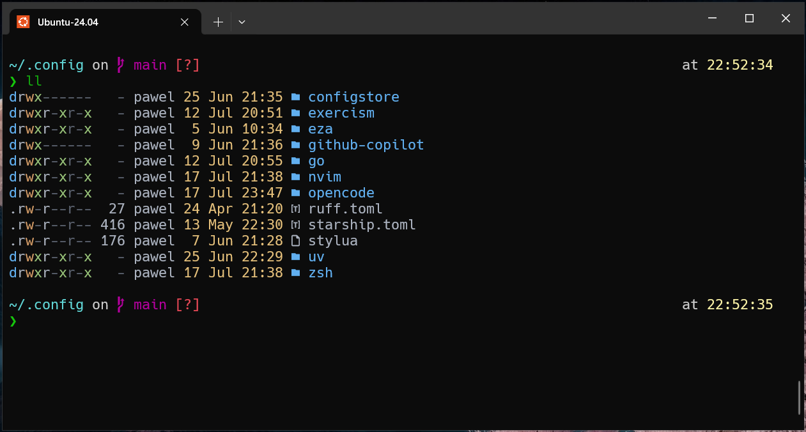

# 🚀 Dotfiles: Your Personalized Development Environment 🚀

Welcome to my personal collection of dotfiles! This repository is designed to help you set up a consistent and powerful development environment across multiple machines. With a single command, you can have your favorite tools configured and ready to go.

## ✨ Features

-   **Consistent Configuration:** Keep your settings for `zsh`, `neovim`, `tmux`, and more in one place.
-   **Easy Installation:** A simple setup process to get you up and running quickly.
-   **Customizable:** Easily extend and modify the configurations to fit your needs.

## 🛠️ Requirements

Before you begin, make sure you have the following tools installed:

-   `stow`: For managing symlinks.
-   `zsh`: A powerful and customizable shell.
-   `git`: For version control.
-   `neovim`: The best text editor!
-   `nodejs`: JavaScript runtime.

## 📦 Included Tools and Configurations

This repository includes configurations for a variety of tools to enhance your terminal and development experience.

### Shell Enhancements

-   **Starship:** A minimal, blazing-fast, and infinitely customizable prompt for any shell!
-   **FZF:** A command-line fuzzy finder for quickly searching and locating files.
-   **Eza:** A modern replacement for `ls` with more features and better defaults.
-   **Bat:** A `cat` clone with syntax highlighting and Git integration.
-   **Zoxide:** A smarter `cd` command that learns your habits.
-   **TLDR:** Collaborative cheatsheets for console commands.

### Development Tools

-   **Bun:** A fast all-in-one JavaScript runtime, bundler, transpiler, and package manager.
-   **Go:** A statically typed, compiled programming language designed at Google.
-   **NVM:** Node Version Manager for managing multiple active Node.js versions.
-   **Pyenv:** Python Version Management for switching between multiple Python versions.
-   **Tmux:** A terminal multiplexer for managing multiple terminal sessions.
-   **Git:** A distributed version control system.

### Editor Configuration

-   **Neovim:** A highly extensible, Vim-based text editor. The configuration includes a wide range of plugins to enhance functionality:
    -   **LSP:** Language Server Protocol support for intelligent code completion and diagnostics.
    -   **Alpha:** A fast and fully programmable start screen.
    -   **Auto-session:** A session manager for Neovim.
    -   **Autopairs:** Inserts or deletes brackets, parens, quotes in pair.
    -   **Bufferline:** A sleek and functional buffer line.
    -   **Colorizer:** A plugin for visualizing colors in your code.
    -   **Colorschema:** A collection of colorschemes.
    -   **Dressing:** A plugin to improve the default UI of Neovim.
    -   **Formatting:** A plugin for formatting your code.
    -   **Indent-blankline:** A plugin to display indentation guides.
    -   **Linting:** A plugin for linting your code.
    -   **Lualine:** A fast and lightweight statusline.
    -   **Cmp:** A completion engine for Neovim.
    -   **Tree:** A file explorer tree.
    -   **Substitution:** A plugin for substitutions.
    -   **Surround:** A plugin for adding/changing/deleting surroundings of text.
    -   **Telescope:** A highly extendable fuzzy finder over lists.
    -   **Treesitter:** A parser generator tool and an incremental parsing library.
    -   **Trouble:** A pretty list for showing diagnostics, references, and more.
    -   **Vim-maximizer:** A plugin to maximize and restore the current window.
    -   **Which-key:** A plugin to display a popup with possible keybindings.

## 📸 Examples

Here are some screenshots showcasing the configured tools in action.

<details>
<summary>Zsh Prompt (Starship)</summary>

</details>

<details>
<summary>Neovim Editor</summary>

</details>

<details>
<summary>Fuzzy Finder (FZF)</summary>

</details>

<details>
<summary>Modern `ls` (Eza)</summary>

</details>

## ⚙️ Installation Steps

### 1. Install Dependencies

First, let's get all the necessary packages installed on your system.

<details>
<summary>For Ubuntu/Debian</summary>

```shell
sudo apt update && sudo apt install -y stow zsh git neovim python3-neovim tmux tree tldr
```

</details>

<details>
<summary>For Fedora</summary>

```shell
sudo dnf install -y stow zsh git neovim python3-neovim tmux tree tldr
```

</details>

### 2. Install `nvm` and `NodeJS` 📦

We use `nvm` to manage Node.js versions.

```shell
curl -o- https://raw.githubusercontent.com/nvm-sh/nvm/v0.40.3/install.sh | bash
nvm install --lts
```

### 3. Install `neovim` 📝

Choose the installation method that best suits your operating system.

<details>
<summary>For Ubuntu</summary>

```shell
sudo add-apt-repository ppa:neovim-ppa/unstable -y
sudo apt update
sudo apt install make gcc ripgrep unzip git xclip neovim
```

</details>

<details>
<summary>For Debian</summary>

```shell
sudo apt update
sudo apt install make gcc ripgrep unzip git xclip curl

# Install nvim
curl -LO https://github.com/neovim/neovim/releases/latest/download/nvim-linux-x86_64.tar.gz
sudo rm -rf /opt/nvim-linux-x86_64
sudo mkdir -p /opt/nvim-linux-x86_64
sudo chmod a+rX /opt/nvim-linux-x86_64
sudo tar -C /opt -xzf nvim-linux-x86_64.tar.gz

# Make it available
sudo ln -sf /opt/nvim-linux-x86_64/bin/nvim /usr/local/bin/
```

</details>

<details>
<summary>For Fedora</summary>

```shell
sudo dnf install -y gcc make git ripgrep fd-find unzip neovim
```

</details>

<details>
<summary>From Source</summary>

```shell
sudo apt remove neovim
sudo apt autoremove
sudo apt install ninja-build gettext cmake unzip curl
git clone https://github.com/neovim/neovim
cd neovim
make CMAKE_BUILD_TYPE=RelWithDebInfo
cd build
cpack -G DEB
sudo dpkg -i --force-overwrite nvim-linux-x86_64.deb
```

</details>

### 4. Apply Configuration 🪄

Now, let's apply the dotfiles configuration.

```shell
cd dotfiles
stow --ignore="README.md" --ignore="examples" -t ~/ .
```

**Note:** If `stow` reports an error, it might be because a file that needs to be symlinked already exists in your home directory. In this case, you should **backup** the existing file(s) and then run the `stow` command again.

### 5. Configure `git` ✍️

Create a `.gitcustom.inc` file to store your personal `git` information.

```shell
touch ~/.gitcustom.inc
```

Then, add the following content to the file:

```
[user]
name = Your Name
email = your.email@gmail.com
```

### 6. Change Your Shell to `zsh` 🐚

Finally, let's make `zsh` your default shell.

```shell
chsh -s $(which zsh)
```

<br>

---

<br>

Enjoy your beautifully configured and efficient terminal! 🎉
